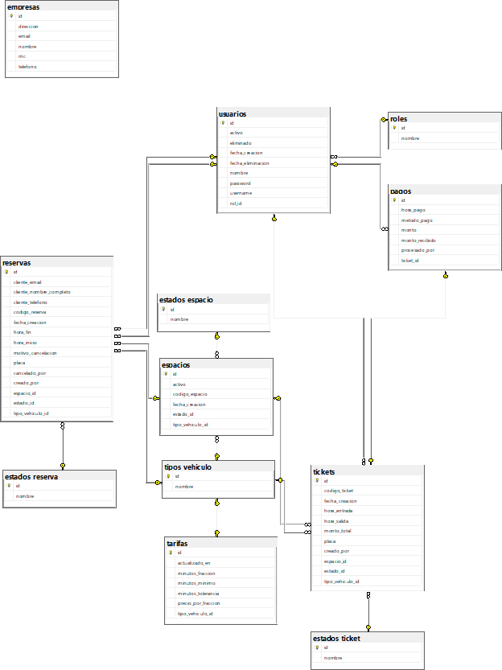

# SmartPark

SmartPark es un sistema de administración de parqueo diseñado para digitalizar y automatizar las operaciones de un estacionamiento. La idea central es reemplazar el control manual —registros en papel, cálculos manuales de cobro, seguimiento informal de espacios— por una solución de software que garantice precisión, trazabilidad y eficiencia en cada operación.

El sistema cubre el ciclo operativo completo de un parqueo: desde que un vehículo entra hasta que sale y paga. Permite registrar la entrada de vehículos asignándoles un espacio numerado, monitorear en tiempo real cuáles espacios están libres u ocupados, calcular automáticamente el monto a cobrar según el tipo de vehículo (carro o moto) y las tarifas configuradas, registrar el método de pago (efectivo o tarjeta), y consultar el historial completo de operaciones.

## Estructura del Proyecto

El proyecto está organizado en tres capas principales, cada una con una responsabilidad clara dentro de la solución:

- **SmartPark.Data**: Encargada del acceso y gestión de los datos, así como de la comunicación con la base de datos.
- **SmartPark.UI**: Implementa la interfaz gráfica de usuario (Windows Forms) y la lógica de negocio/servicio que conecta la interfaz con los datos.
- **SmartPark.Tests**: Contiene las pruebas unitarias para asegurar la calidad y correcto funcionamiento de los servicios y componentes principales.

## Diagrama de la Base de Datos

